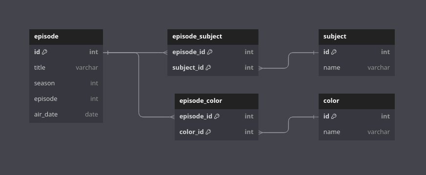

# The Joy of Coding

This repo explores the idea of using ETL, or "Extract," "Transform," and "Load" to manipulate and coalesce data about Bob Ross's the Joy of Painting from several sources into a single database. This data will be structured such that it can be easily queried to find information on broadcast dates, subject matter, and color palettes used.

Users can access this data more efficiently using an API created using Prisma and Node.JS

## Database Layout

